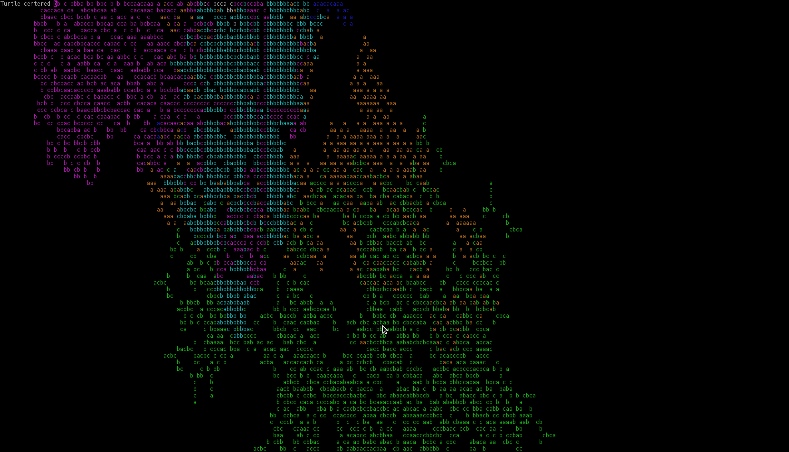

# metropolis
Interpreter for the language 'Metropolis' on esolangs.org. The language was created by Brian Thompson. 

A 'program' is a set of rules describing movement, reading, and writing on a two-dimensional grid of printable ascii characters. The grid is initially filled with spaces.

The language is described here:
http://esolangs.org/wiki/Metropolis


The interpreter can be invoked with multiple scripts. All of the scripts will be run in the same grid.

The simulation will run much faster is the camera is off. 

```
Keys:
C - change camera
T - change selected turtle
F3 - show rules
F5 - run
F1 - help
```

Here's what running everything in the 'petri' folder simultaneously looks like on a really big console:

